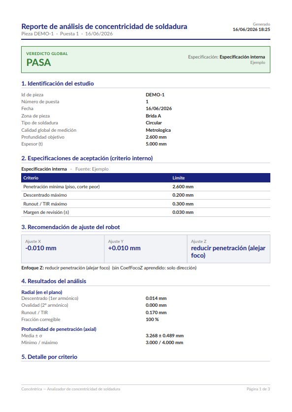
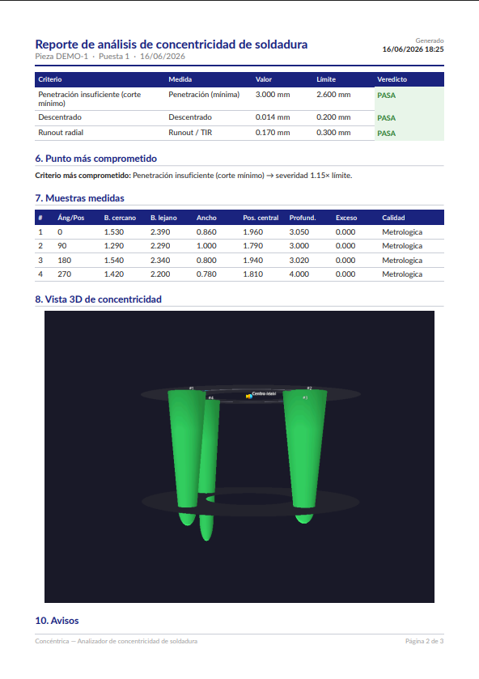
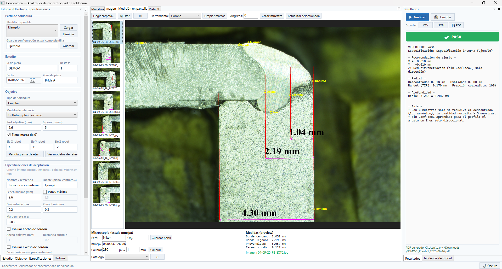
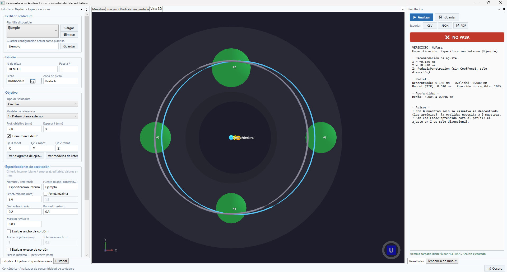

# Concéntrica

> Analizador de concentricidad de soldadura

Aplicación de escritorio **local y autónoma** para Windows que, a partir de mediciones
metalográficas de soldaduras láser (circulares o lineales), evalúa **centrado/concentricidad** y
**penetración** contra una norma, marca en **3D** lo que queda fuera de especificación y recomienda
el **ajuste del robot** (X/Y para centrado, Z para enfoque/penetración) — o avisa cuándo solo queda
ajuste mecánico.

Toda la captura y la visualización ocurren dentro del programa: **no depende de Excel ni de internet**.

---

## Inicio rápido (para usar la app, sin programar)

¿No programas ni usas VS Code? Tienes dos caminos:

- **A) Descargar el ejecutable (lo más fácil).** Si hay una versión publicada, ve a la pestaña
  **[Releases](https://github.com/HdzDaniel7/Concentrica/releases)** del proyecto, descarga
  **`Concentrica.exe`** y ábrelo con doble clic. Es autónomo: **no requiere instalar nada**.

- **B) Crear el ejecutable tú mismo** (si descargaste el código en ZIP). Necesitas el
  [SDK de .NET 10](https://dotnet.microsoft.com/download/dotnet/10.0) instalado una sola vez; luego:
  1. Doble clic en **`Crear-ejecutable.bat`** → genera `Concentrica.exe` en la carpeta principal.
  2. Doble clic en **`Ejecutar-Concentrica.bat`** (o en `Concentrica.exe`) para abrir la app.

  > `Ejecutar-Concentrica.bat` es inteligente: si encuentra el `.exe` lo abre; si no, intenta
  > iniciar la app desde el código; y si falta todo, te dice qué hacer.

---

## Contenido

- [Vista previa](#vista-previa)
- [Características](#características)
- [Stack técnico](#stack-técnico)
- [Estructura del proyecto](#estructura-del-proyecto)
- [Requisitos](#requisitos)
- [Compilar y ejecutar desde el código](#compilar-y-ejecutar-desde-el-código)
- [Generar el ejecutable](#generar-el-ejecutable)
- [Flujo de uso](#flujo-de-uso)
- [Esquema de datos en disco](#esquema-de-datos-en-disco)
- [Pruebas](#pruebas)
- [Estado y hoja de ruta](#estado-y-hoja-de-ruta)
- [Licencias de terceros](#licencias-de-terceros)

---

## Vista previa

Reporte PDF generado por la app a partir de un estudio de ejemplo (8 cortes de una soldadura
circular). La izquierda muestra el veredicto, las especificaciones y la **recomendación X/Y/Z**;
la derecha, el **detalle por criterio** (con el semáforo PASA/REVISAR/NO PASA) y la tabla de muestras.

<p align="center">
  
  
</p>

> Imágenes generadas con datos sintéticos; el reporte real incluye además la vista 3D y los
> overlays de medición cuando están disponibles.

---

## Características

- **Motor de análisis** (núcleo puro, sin UI):
  - Ajuste de Fourier por mínimos cuadrados del radio de la línea central → separa
    **descentrado** (1er armónico, corregible con offset de robot) de **ovalidad/vibración**
    (armónicos superiores, error mecánico). Honra el límite de resolución según el nº de muestras.
  - Estadística de profundidad y ancho (media ± σ, rango), **runout/TIR**, punto más sensible.
  - **Recomendación X/Y/Z** del robot, con rotación al marco de coordenadas físico del robot.
  - **Aprendizaje del coeficiente foco↔Z** por regresión del histórico (profundidad media vs. Z aplicado).
  - **Tendencia de runout** entre puestas con proyección de cuándo se superará el límite.
- **Motor de normas declarativo** (reglas en función del espesor) + criterio interno del usuario
  (piso/techo de penetración, descentrado, runout, ancho, exceso de cordón) con veredicto
  PASA / REVISAR / NO PASA.
- **Modelos de referencia** seleccionables (datum plano externo, radial desde el eje, dos features,
  contorno de pieza, solo geometría del cordón). El modelo «solo cordón» desactiva el análisis de
  centrado por no tener datum externo.
- **Visor de imágenes** con zoom/pan, calibración px→mm y medición sobre la imagen (8 marcas) con
  generación de _overlay_.
- **Vista 3D** (Helix Toolkit): nuggets de soldadura coloreados por semáforo de penetración, cúpula
  de corona, anillo de referencia, centros ideal/real y vector de ajuste X/Y.
- **Historial en carpetas locales** elegidas por el usuario (JSON por estudio), con búsqueda/filtrado.
- **Exportación** a PDF (reporte completo con vista 3D y overlays incrustados), CSV y JSON.
- **Tema claro/oscuro** conmutable en caliente.

<p align="center">
  
  
</p>

## Stack técnico

- **C# / .NET 10** (LTS) — Windows.
- **WPF (MVVM)** con [CommunityToolkit.Mvvm](https://github.com/CommunityToolkit/dotnet) y paneles
  acoplables [Dirkster.AvalonDock](https://github.com/Dirkster99/AvalonDock).
- **[HelixToolkit.Wpf](https://github.com/helix-toolkit/helix-toolkit)** para el 3D.
- **[Math.NET Numerics](https://numerics.mathdotnet.com/)** para el ajuste armónico.
- **[QuestPDF](https://www.questpdf.com/)** (Community) para el reporte PDF.
- **xUnit** para las pruebas.

## Estructura del proyecto

```
soldadura-analyzer/
├─ Soldadura.Core/      Núcleo puro y testeable (sin dependencias de UI)
│  ├─ Modelo/           Entidades de dominio (Estudio, Muestra, PerfilSoldadura, ...)
│  ├─ Analisis/         Motor de análisis (Fourier, estadística, tendencia, foco↔Z)
│  ├─ Normas/           Motor de normas declarativo
│  ├─ Imagen/           Medición sobre imagen (px→mm)
│  └─ Persistencia/     Repositorios JSON, export CSV/PDF
├─ Soldadura.App/       Aplicación WPF (MVVM)
│  ├─ ViewModels/       MainViewModel y sub-VMs
│  ├─ Controls/         Visor de imagen, vista 3D, ventanas auxiliares
│  ├─ Visor3D/          Construcción de la escena 3D
│  ├─ Converters/       IValueConverter / ValidationRule
│  └─ Temas/            Diccionarios de color claro/oscuro
├─ Soldadura.Tests/     Pruebas unitarias (xUnit)
├─ publish.ps1          Script de publicación del ejecutable
└─ Soldadura.slnx       Solución
```

## Requisitos

- **Windows 10/11 (x64)**.
- Para **compilar**: [.NET SDK 10](https://dotnet.microsoft.com/download/dotnet/10.0).
- Para **ejecutar el publicado**: nada — el ejecutable es _self-contained_ (incluye el runtime).

## Compilar y ejecutar desde el código

```powershell
# Restaurar y compilar la solución
dotnet build Soldadura.slnx

# Ejecutar la aplicación
dotnet run --project Soldadura.App/Soldadura.App.csproj
```

## Generar el ejecutable

El script `publish.ps1` genera un **.exe self-contained de archivo único** en `publish/`
(carpeta ignorada por git, así que el binario no se versiona):

```powershell
./publish.ps1
# Resultado: publish/Concentrica.exe  (≈ 69 MB, no requiere instalar .NET)
```

Opciones:

```powershell
./publish.ps1 -Runtime win-x64 -Output dist -Configuration Release
```

Para distribuir basta con copiar `Concentrica.exe`.

## Flujo de uso

1. **Elige la carpeta raíz del historial** (panel «Historial»). Se recuerda entre sesiones.
2. **Define o carga un perfil**: tipo de soldadura, modelo de referencia, geometría objetivo,
   especificaciones de aceptación y ejes del robot. Los perfiles se guardan como plantillas reutilizables.
3. **Captura las muestras**: a mano (anotación directa) o midiendo sobre la imagen del microscopio.
4. **Analiza**: obtienes el veredicto, la recomendación X/Y/Z, la estadística y la vista 3D.
5. (Opcional) **Registra el ajuste aplicado** al robot por puesta; tras varias puestas, usa
   **«Aprender CoefFocoZ del historial»** para que la recomendación en Z dé una magnitud, no solo dirección.
6. **Guarda el estudio** y **exporta** el reporte (PDF/CSV/JSON).
7. Revisa la **tendencia de runout** entre puestas de la misma pieza.

## Esquema de datos en disco

Cada estudio es una carpeta autocontenida bajo la raíz elegida:

```
<Raíz>/
└─ <idPieza>/
   └─ Puesta<n>_<AAAA-MM-DD>/
      ├─ datos.json     Estudio + muestras + resultados
      ├─ imagenes/      Imágenes del microscopio (copiadas)
      ├─ overlays/      Overlays de medición generados
      └─ reporte.pdf    (al exportar)
```

Los perfiles reutilizables se guardan en `<Raíz>/perfiles-soldadura/<slug>.json`.

## Pruebas

```powershell
dotnet test Soldadura.Tests/Soldadura.Tests.csproj
```

El núcleo está cubierto por pruebas unitarias (ajuste armónico, estadística, motor de análisis y de
normas, persistencia, medición sobre imagen, tendencia y aprendizaje de foco↔Z).

## Estado y hoja de ruta

Funcional de extremo a extremo: captura → análisis → 3D → historial → reporte. Pendiente principal:

- **Norma publicada**: el _ruleset_ embebido de ISO 13919-1:2019 es **provisional** (sin verificar
  contra la edición oficial). El criterio interno del usuario sí es plenamente funcional.
- Validar la convención de ejes para soldadura lineal y, opcionalmente, campos de captura distintos
  según el modelo de referencia.

## Licencias de terceros

QuestPDF se usa bajo su **licencia Community** (gratuita para organizaciones por debajo del umbral
de ingresos definido por QuestPDF). Verifica que tu uso cumpla esa licencia antes de un despliegue comercial.
